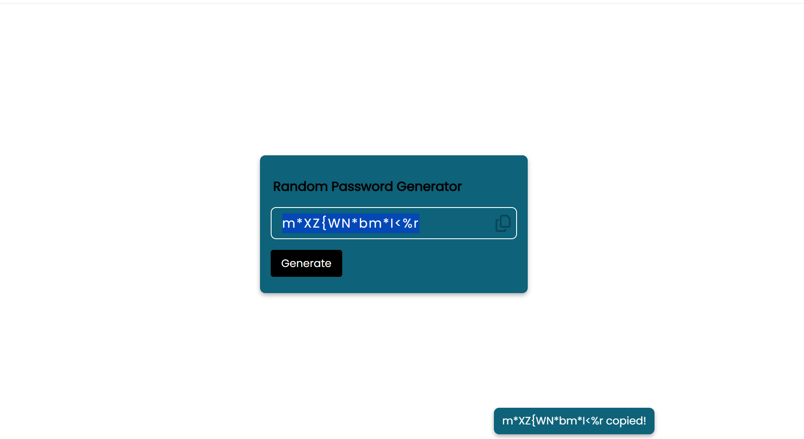

# 🔐 Random Password Generator

A modern and responsive **Random Password Generator** built using HTML, CSS, and JavaScript.

This project generates a secure 15-character password that includes:
- Uppercase letters (A–Z)
- Lowercase letters (a–z)
- Numbers (0–9)
- Special symbols (!@#$%^&* etc.)

It also allows users to copy the generated password instantly to the clipboard with a confirmation alert.
---

## 🚀 Features
- Generate strong random passwords
- One-click copy to clipboard
- Clean and modern user interface
- Responsive layout
- Visual alert notification after copying

## 🖼️ Preview

---

## 🛠️ Technologies Used
- HTML5
- CSS3
- JavaScript (Vanilla JS)
- Font Awesome Icons

## 📂 Project Structure
password-generator/
│
├── index.html
├── style.css
├── script.js
├── screenshot.png
└── README.md

## ⚙️ How It Works
1. Click the **Generate** button.
2. JavaScript randomly selects characters from a predefined character set.
3. A 15-character password is created.
4. Click the copy icon to copy the password to the clipboard.
5. A confirmation alert appears.

## 🔐 Example Generated Password

aK9$Lm2!Xp0@Qr5
---

## 📥 Installation
Clone the repository:
git clone https://github.com/takundagorogodo/password-generator.git

Navigate into the project folder:
cd password-generator
Open `index.html` in your browser.
---

## 📌 Future Improvements
- Add password strength meter
- Allow custom password length selection
- Add toggle options (include/exclude symbols)
- Add dark/light mode
- Deploy using GitHub Pages

## 👨‍💻 Author

Takundah Gorogodo  
GitHub: https://github.com/takundagorogodo

⭐ If you found this project useful, consider giving it a star!
